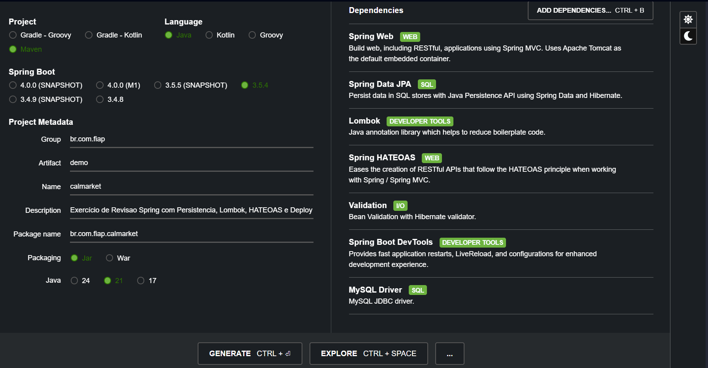
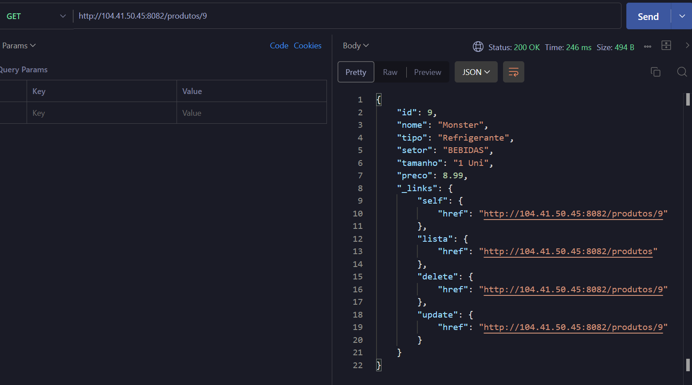
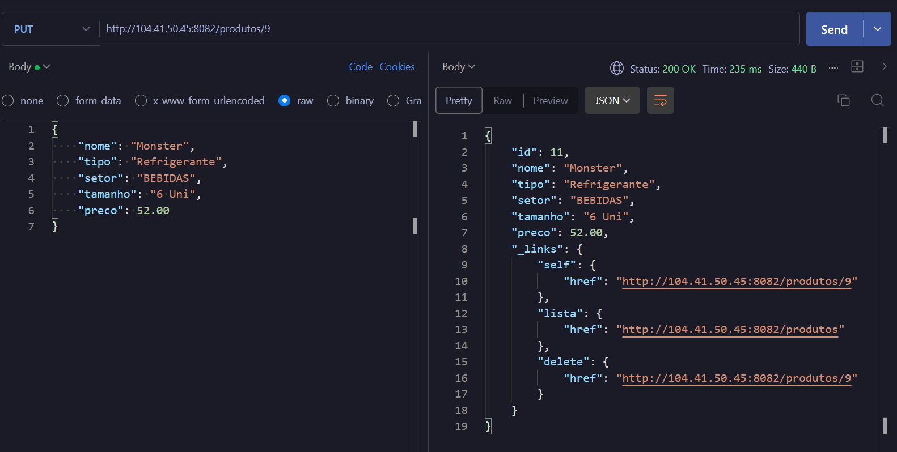
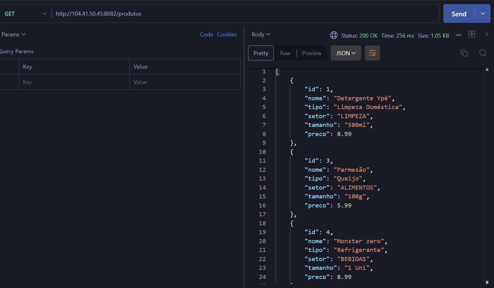

# $CALMARKET$

#### Exercício de Revisão Spring com Persistência, Lombok, HATEOAS e Deploy

[integrantes](#integrantes)

## **Objetivo**

Construir um programa para um mercado express em java, com base no framework spring boot, configurado para o tipo maven, incluindo o Lombok e aplicando o nível de maturidade 3 com HATEOAS.

> Usamos o IntelliJ

## **Inicialização com Spring Initializr**



Dependências selecionadas:

- Spring Web
- Spring Data JPA
- MySQL Driver
- Lombok
- Spring Boot DevTools
- Spring Validation
- Spring HATEOAS

## **Estrutura**

A aplicação "calmarket" está dividida em:

- Model
- Dao
- Controller
- Exception
- resources

---

### _Model_

Responsável por armazenar as entidades da aplicação, neste caso, a entidade `Produto`.

#### _Classe Produto_

A classe `Produto` representa os dados persistidos no banco de dados. Fizemos uso das seguintes bibliotecas para facilitar sua construção:

#### _Lombok_

Utilizamos anotações Lombok para reduzir o código e torna-lo mais limpo:

- @Getter / @Setter – gera automaticamente os métodos getters e setters.
- @ToString – gera o método toString() para exibição legível.
- @AllArgsConstructor / @NoArgsConstructor – construtores com e sem argumentos.

#### _Jakarta_

As anotações Jakarta são utilizadas para mapear a entidade para o banco de dados e aplicar validações:

- _@Entity_ – indica que a classe representa uma entidade JPA.
- _@Table_ – define o nome da tabela.
- _@Id_ / _@GeneratedValue_ – identifica a chave primária.
- _@Column_ – define as propriedades da coluna.
- _@NotBlank_, _@NotNull_ – validações de dados antes da persistência.

> Por padrão, o MySQL auto incrementa a primary key. Não precisamos informar um valor ao cadastrar, ele será gerado automaticamente.

<details>
  <summary><b>Produto</b></summary>

```java
package br.com.fiap.calmarket.Model;

import jakarta.persistence.*;
import jakarta.validation.constraints.DecimalMin;
import jakarta.validation.constraints.NotBlank;
import lombok.*;

import java.math.BigDecimal;

@Getter
@Setter
@ToString
@AllArgsConstructor
@NoArgsConstructor
@Entity
@Table(name = "CM_TB_PRODUTO")
public class Produto {

    @Id
    @Column(name = "ID", unique = true, nullable = false)
    @GeneratedValue(strategy = GenerationType.IDENTITY)
    private int id;

    @Column(name = "NOME", nullable = false)
    @NotBlank(message = "Campo de 'NOME' é obrigatório")
    private String nome;

    @Column(name = "TIPO", nullable = false)
    @NotBlank(message = "Campo de 'TIPO' é obrigatório")
    private String tipo;

    @Column(name = "SETOR", nullable = false)
    @Enumerated(EnumType.STRING)
    private Setor setor;

    @Column(name = "TAMANHO", nullable = false)
    @NotBlank(message = "Campo de 'TAMANHO' é obrigatório")
    private String tamanho;

    @Column(name = "PRECO", nullable = false, precision = 10, scale = 2)
    @DecimalMin(value = "0.0", inclusive = false, message = "O preço deve ser maior que zero")
    private BigDecimal preco;
}

```

</details>

#### **Enum Setor**

A enumeração _Setor_ representa os possíveis setores de um produto.

Utilizar um _enum_ traz vantagens:

- Garante integridade dos dados (evita erro de digitação)
- Facilita a manutenção e crescimento futuro
- Facilita a validação e exibição no front-end

<details>
  <summary><b>Setor</b></summary>

```java
package br.com.fiap.calmarket.Model;

public enum Setor {
    LIMPEZA, HORTIFRUTI, PANIFICADORA, ALIMENTOS, UTENSILIOS, BEBIDAS
}
```

</details>

---

### _Dao_

Responsável pela comunicação com o banco de dados e pela persistência das entidades da aplicação.

#### **GenericDao**

Interface genérica que define os métodos base de persistência.

- Utiliza parâmetros genéricos <T, K>, onde:
  - T: representa uma classe de entidade
  - K: representa o tipo do ID da entidade

> Usado como boas práticas no processo de desenvolvimento

<details>
  <summary><b>GenericDao</b></summary>

```java
package br.com.fiap.calmarket.Dao;

import java.util.List;

public interface GenericDao<T,K> {
    T cadastrar (T entidade);

    void remover(K id);

    T buscar(K id);

    T atualizar(T entidade, K id);

    List<T> listar();
}

```

</details>

#### **GenericDaoImpl**

Implementação da interface GenericDao, contendo a lógica para persistência, consulta, atualização e remoção de registros via EntityManager.

- @PersistenceContext: Injeta o EntityManager da JPA, responsável pela comunicação com o banco.
- @Transactional: Garante que as operações sejam executadas dentro de uma transação.

Embora nesta aplicação o uso de apenas uma entidade não evidencie seu impacto, o padrão DAO genérico oferece vantagens como:

- Reutilização de código
- Padronização
- Escalabilidade
- Facilidade de manutenção

> DRY — Don't Repeat Yourself

<details>
  <summary><b>GenericDaoImpl</b></summary>

```java
package br.com.fiap.calmarket.Dao;

import br.com.fiap.calmarket.Exception.IdNaoEncontradoException;
import jakarta.persistence.EntityManager;
import jakarta.persistence.PersistenceContext;
import org.springframework.transaction.annotation.Transactional;

import java.lang.reflect.ParameterizedType;
import java.util.List;

public class GenericDaoImpl<T, K> implements GenericDao<T, K> {

    @PersistenceContext
    protected EntityManager em;

    private final Class<T> clazz;

    @SuppressWarnings("unchecked")
    public GenericDaoImpl() {
        this.clazz = (Class<T>) ((ParameterizedType) getClass()
                .getGenericSuperclass()).getActualTypeArguments()[0];
    }

    @Override
    @Transactional
    public T cadastrar(T entidade) {
        return em.merge(entidade); // ou persist se for novo
    }

    @Override
    @Transactional
    public void remover(K id) {
        T entidade = buscar(id);
        em.remove(entidade);
    }

    @Override
    @Transactional(readOnly = true)
    public T buscar(K id) {
        T entidade = em.find(clazz, id);
        if (entidade == null)
            throw new IdNaoEncontradoException("ID NÃO ENCONTRADO");
        return entidade;
    }

    @Override
    @Transactional
    public T atualizar(T entidade, K id) {
        T object = em.find(clazz, id);
        if (object == null)
            throw new IdNaoEncontradoException("ID NÃO ENCONTRADO");
        return em.merge(entidade);
    }

    @Override
    @Transactional(readOnly = true)
    public List<T> listar() {
        return em.createQuery("FROM " + clazz.getSimpleName(), clazz).getResultList();
    }
}

```

</details>

#### **ProdutoDao**

ProdutoDao

Interface que estende GenericDao, ajustando os tipos genéricos para a entidade Produto.

- Define <Produto, Integer>, especificando o tipo de entidade e o tipo de ID.
- Não adiciona novos métodos, mas permite especialização futura.

> Promove reutilização sem duplicação de lógica.

<details>
  <summary><b>ProdutoDao</b></summary>

```java
package br.com.fiap.calmarket.Dao;

import br.com.fiap.calmarket.Model.Produto;

public interface ProdutoDao extends GenericDao<Produto, Integer> {

}

```

</details>

#### **ProdutoDaoImpl**

Classe que implementa _ProdutoDao_ e estende _GenericDaoImpl_, herdando toda a lógica de persistência.

- Anotada com @Repository, tornando-a um componente do Spring para gerenciamento de persistência.

> O uso da DAO genérica reduz significativamente a duplicação de código.

<details>
  <summary><b>ProdutoDaoImpl</b></summary>

```java
package br.com.fiap.calmarket.Dao;

import br.com.fiap.calmarket.Model.Produto;
import org.springframework.stereotype.Repository;

@Repository
public class ProdutoDaoImpl extends GenericDaoImpl<Produto, Integer> implements ProdutoDao {
    public ProdutoDaoImpl() {
        super();
    }
}

```

</details>

---

### _Controller_

Responsável por expor os endpoints (URLs) da API e receber as requisições HTTP do cliente, encaminhando-as para a camada de persistência (DAO) e retornando as respostas apropriadas.

Na aplicação, temos apenas o ProdutoController.

- @RestController: Marca a classe como um controlador REST, permitindo o retorno de objetos JSON diretamente.
- @RequestMapping("/produtos"): Define o caminho base para todos os endpoints da classe.
- @Autowired: Injeta automaticamente a dependência (ProdutoDaoImpl) para acesso ao banco de dados.

#### **HATEOAS**

**HATEOAS** (Hypermedia As The Engine Of Application State) é um princípio de arquitetura REST.
Não é exatamente uma função ou biblioteca específica, mas sim um **estilo de construir APIs**, onde a resposta não só traz os dados, mas também **fornece links** para ações relacionadas.

Isso aumenta a maturidade e a descoberta da API, pois o próprio retorno indica ao cliente quais operações podem ser feitas a seguir.

```json
{
  "id": 9,
  "nome": "Monster",
  "tipo": "Refrigerante",
  "setor": "BEBIDAS",
  "tamanho": "1 Uni",
  "preco": 8.99,
  "_links": {
    "self": {
      "href": "http://104.41.50.45:8082/produtos/9"
    },
    "lista": {
      "href": "http://104.41.50.45:8082/produtos"
    },
    "delete": {
      "href": "http://104.41.50.45:8082/produtos/9"
    },
    "update": {
      "href": "http://104.41.50.45:8082/produtos/9"
    }
  }
}
```

<details>
  <summary><b>ProdutoController</b></summary>

```java
package br.com.fiap.calmarket.Controller;

import br.com.fiap.calmarket.Dao.ProdutoDaoImpl;
import br.com.fiap.calmarket.Model.Produto;
import jakarta.validation.Valid;
import org.springframework.beans.factory.annotation.Autowired;
import org.springframework.hateoas.EntityModel;
import org.springframework.http.HttpStatus;
import org.springframework.http.ResponseEntity;
import org.springframework.web.bind.annotation.*;

import java.util.List;

import static org.springframework.hateoas.server.mvc.WebMvcLinkBuilder.linkTo;
import static org.springframework.hateoas.server.mvc.WebMvcLinkBuilder.methodOn;

@RestController
@RequestMapping("/produtos")
public class ProdutoController {

    private final ProdutoDaoImpl produtoDao;

    @Autowired
    public ProdutoController(ProdutoDaoImpl produtoDao) {
        this.produtoDao = produtoDao;
    }

    @GetMapping("/index")
    public ResponseEntity<String> index() {
        return ResponseEntity.ok("Produtos");
    }

    @GetMapping()
    public List<Produto> listar() {
        return produtoDao.listar();
    }

    @GetMapping("/{id}")
    public EntityModel<Produto> procurarPorId(@PathVariable int id) {
        Produto produto = produtoDao.buscar(id);
        return EntityModel.of(produto,
                linkTo(methodOn(ProdutoController.class).procurarPorId(id)).withSelfRel(),
                linkTo(methodOn(ProdutoController.class).listar()).withRel("lista"),
                linkTo(methodOn(ProdutoController.class).removerPorId(id)).withRel("delete"),
                linkTo(methodOn(ProdutoController.class).atualizar(id, produto)).withRel("update")
        );
    }

    @PostMapping("/cadastrar")
    public ResponseEntity<EntityModel<Produto>> cadastrar(@RequestBody @Valid Produto produto) {
        Produto novo = produtoDao.cadastrar(produto);

        EntityModel<Produto> model = EntityModel.of(novo,
                linkTo(methodOn(ProdutoController.class).procurarPorId(novo.getId())).withSelfRel(),
                linkTo(methodOn(ProdutoController.class).listar()).withRel("lista"),
                linkTo(methodOn(ProdutoController.class).atualizar(novo.getId(), novo)).withRel("update"),
                linkTo(methodOn(ProdutoController.class).removerPorId(novo.getId())).withRel("delete")
        );

        return ResponseEntity
                .created(linkTo(methodOn(ProdutoController.class).procurarPorId(novo.getId())).toUri())
                .body(model);
    }


    @PutMapping("/{id}")
    public EntityModel<Produto> atualizar(@PathVariable int id, @Valid @RequestBody Produto produto) {
        Produto atualizado = produtoDao.atualizar(produto, id);

        return EntityModel.of(atualizado,
                linkTo(methodOn(ProdutoController.class).procurarPorId(id)).withSelfRel(),
                linkTo(methodOn(ProdutoController.class).listar()).withRel("lista"),
                linkTo(methodOn(ProdutoController.class).removerPorId(id)).withRel("delete")
        );
    }

    @DeleteMapping("/{id}")
    public ResponseEntity<Void> removerPorId(@PathVariable int id) {
        produtoDao.remover(id);
        return ResponseEntity.noContent().build(); // 204
    }


}

```

</details>

---

## **Application properties**

Arquivo responsável por definir parâmetros de configuração da aplicação.

Nele ficam centralizadas as informações de conexão com o banco de dados, ajustes do Hibernate e comportamento geral do servidor.

| **Propriedade**                              | **Função**                                                                                                           |
| -------------------------------------------- | -------------------------------------------------------------------------------------------------------------------- |
| `spring.application.name`                    | Define o nome da aplicação.                                                                                          |
| `spring.datasource.url`                      | URL de conexão com o banco de dados.                                                                                 |
| `spring.datasource.username`                 | Usuário do banco de dados.                                                                                           |
| `spring.datasource.password`                 | Senha do banco de dados.                                                                                             |
| `spring.jpa.hibernate.ddl-auto`              | Controla se o Hibernate deve criar, atualizar ou validar o schema do banco (`create`, `update`, `validate`, `none`). |
| `spring.jpa.show-sql`                        | Exibe no terminal os comandos SQL executados.                                                                        |
| `spring.jpa.properties.hibernate.format_sql` | Formata a saída dos SQLs no terminal para melhor leitura.                                                            |
| `spring.jpa.database-platform`               | Define o dialeto do banco (por exemplo, `org.hibernate.dialect.MySQLDialect`).                                       |
| `server.error.include-message`               | Inclui a mensagem de erro no corpo da resposta HTTP.                                                                 |

---

## **API Socket TCP com Criptografia RSA**

[Clique aqui para seguir com a documentação](parte1-socket-rsa\README_PARTE1.md)

## **Deploy**

O deploy da aplicação foi realizado em uma **máquina virtual (VM) Linux** hospedada na **Microsoft Azure**, utilizando **Docker** para encapsular e executar os serviços.

A aplicação roda em **dois containers**:

1. **MySQL** – Banco de dados da aplicação
2. **Aplicação Java** – API desenvolvida em Spring Boot, empacotada em um arquivo `.jar`

### **Docker Compose**

O _docker-compose_ é responsável por **subir e orquestrar os containers**.
Na nossa configuração:

1. **Primeiro** o banco de dados (mysql) é iniciado.
2. **Depois** a aplicação Java (calmarket-app) é iniciada, garantindo que o banco já esteja pronto para conexões.

Para executar:

```bash
git clone https://github.com/Entrega-CheckPoint/JAVA-CP4-CALMARKET

docker compose up -d --build
```

<details>
  <summary><b>docker-compose.yml</b></summary>

```yaml
version: "3.8"
services:
  postgres:
    image: postgres:15.14-alpine3.21
    container_name: calmarket-db
    ports:
      - "5432:5432"
    environment:
      POSTGRES_DB: calmarket
      POSTGRES_USER: caluser
      POSTGRES_PASSWORD: calpass
    volumes:
      - calmarket_data:/var/lib/postgresql/data
    restart: unless-stopped
  calmarket-app:
    build: ./calmarket
    container_name: calmarket-api
    depends_on:
      - mysql
    ports:
      - "8082:8080"
    restart: unless-stopped

volumes:
  calmarket_data:
```

</details>

### **Mapeamento de Portas**

No parâmetro `ports` usamos a sintaxe **`host:container`**, que mapeia uma porta da máquina hospedeira para a porta interna do container.

Aplicação:

```yaml
ports:
  - "8082:8080"
```

Isso significa que:

- **8082** → Porta acessível na VM (externa)
- **8080** → Porta onde o Spring Boot roda dentro do container

---

## **Testes**

### _CREATE_


---

### _READ_



#### _READ-ERROR_


---

### _UPDATE_



---

### _DELETE_


#### _DELETE-ERROR_


---

### _LIST_



---

## **Integrantes**

| Nome                     | RM     |
| ------------------------ | ------ |
| Francesco M Di Benedetto | 557313 |
| Victor Nieves Britto     | 554557 |
| Gabriel Alves Thomaz     | 558637 |
| Gustavo Goulart Bretas   | 555708 |
| Nathália Gomes da Silva  | 554945 |
